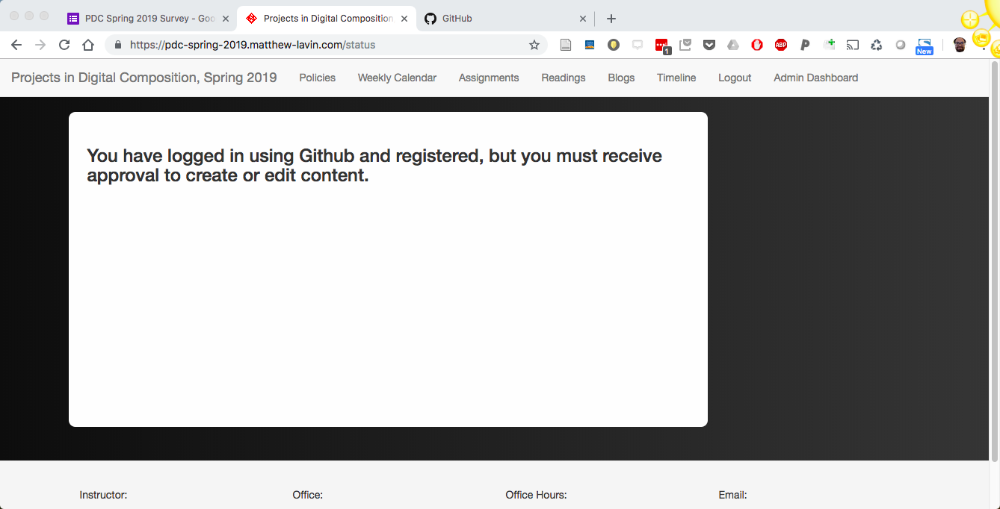
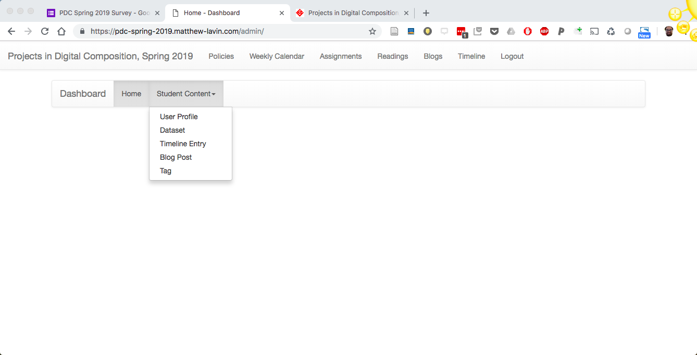
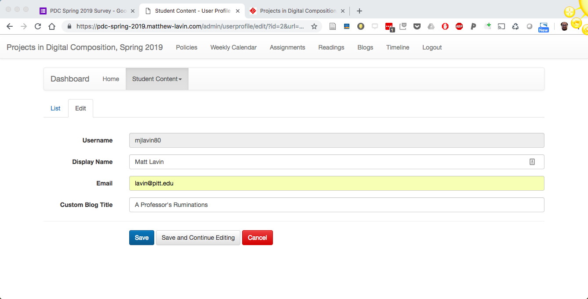

# Instructions to Set Up Blog and Custom Blog Name

1. Go to https://arm-fall-2019.matthew-lavin.com
2. Click the menu link titled "Login". This link will direct you to log in with your Github username and password.
3a. Verify that a new link titled "Admin Dashboard" now appears in the menu. 
3b. If the link does not appear and you are brought to a screen that says "you must receive approval to create or edit content," inform me in class (see screenshot below) 

This warning message means I have not yet approved your Github username, which could be a mistake on my end or an issue with the Github username you e-mailed me. If you forgot to e-mail me your username, please do so immediately.    

4. Click the link titled "Admin Dashboard" and, under the student content submenu, click the link titled "User Profile" (see screenshot below)

5. Your Github username should appear in gray. Add a display name such as "Matt L." or "Matt Lavin", your Pitt email address, and a custom blog title (see screenshot below)

Your blog title should be distinct and describe you or your interests in some way. For example, my blog title is "A Professor's Ruminations." Your blog title will appear on https://arm-fall-2019.matthew-lavin.com/blogs. The web address of your blog will be your blog title with spaces converted to hyphens. 

6. When you have completed these steps, click the blue "Save" button
7. Navigate to https://arm-fall-2019.matthew-lavin.com/blogs and verify that your blog title is listed. Click on your blog title to verify that the link bring you to a page for your blog. 
8. In the next assignment, we will create our first blog post!
